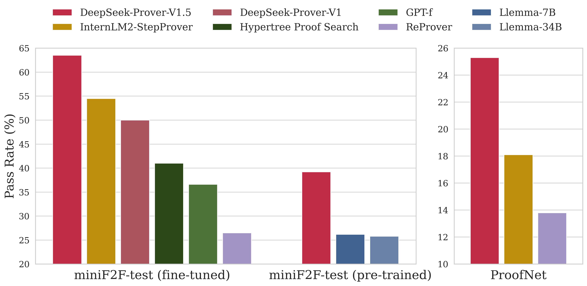

<!-- markdownlint-disable first-line-h1 -->
<!-- markdownlint-disable html -->
<!-- markdownlint-disable no-duplicate-header -->

<div align="center">
  
</div>
<hr>
<div align="center" style="line-height: 1;">
  <a href="https://www.deepseek.com/" target="_blank" style="margin: 2px;">
    
  </a>
  <a href="https://chat.deepseek.com/" target="_blank" style="margin: 2px;">
    
  </a>
  <a href="https://huggingface.co/deepseek-ai" target="_blank" style="margin: 2px;">
    
  </a>
</div>

<div align="center" style="line-height: 1;">
  <a href="https://discord.gg/Tc7c45Zzu5" target="_blank" style="margin: 2px;">
    
  </a>
  <a href="https://github.com/deepseek-ai/DeepSeek-V2/blob/main/figures/qr.jpeg?raw=true" target="_blank" style="margin: 2px;">
    
  </a>
  <a href="https://twitter.com/deepseek_ai" target="_blank" style="margin: 2px;">
    
  </a>
</div>
<div align="center" style="line-height: 1;">
  <a href="https://github.com/deepseek-ai/DeepSeek-V2/blob/main/LICENSE-CODE" style="margin: 2px;">
    
  </a>
  <a href="https://github.com/deepseek-ai/DeepSeek-V2/blob/main/LICENSE-MODEL" style="margin: 2px;">
    
  </a>
</div>
<p align="center">
  <a href="#3-evaluation-results">Evaluation Results</a> |
  <a href="#3-model-downloads">Model Download</a> |
  <a href="#4-setup-environment">Setup Environment</a> |
  <a href="#5-quick-start">Quick Start</a> |
  <a href="#6-questions-and-bugs">Questions and Bugs</a> |
  <a href="#7-license">License</a> |
  <a href="#8-citation">Citation</a> |
  <a href="#9-contact">Contact</a>
</p>


<p align="center">
  <a href="https://arxiv.org/abs/2408.08152"><b>Paper Link</b>👁️</a>
</p>

# DeepSeek-Prover-V1.5: Harnessing Proof Assistant Feedback for Reinforcement Learning and Monte-Carlo Tree Search

## 1. Introduction

We introduce DeepSeek-Prover-V1.5, an open-source language model designed for theorem proving in Lean 4, which enhances DeepSeek-Prover-V1 by optimizing both training and inference processes. Pre-trained on DeepSeekMath-Base with specialization in formal mathematical languages, the model undergoes supervised fine-tuning using an enhanced formal theorem proving dataset derived from DeepSeek-Prover-V1. Further refinement is achieved through reinforcement learning from proof assistant feedback (RLPAF). Beyond the single-pass whole-proof generation approach of DeepSeek-Prover-V1, we propose RMaxTS, a variant of Monte-Carlo tree search that employs an intrinsic-reward-driven exploration strategy to generate diverse proof paths. DeepSeek-Prover-V1.5 demonstrates significant improvements over DeepSeek-Prover-V1, achieving new state-of-the-art results on the test set of the high school level miniF2F benchmark (63.5%) and the undergraduate level ProofNet benchmark (25.3%).

<p align="center">
  
</p>


## 2. Evaluation Results

<div align="center">

|  | miniF2F-test | ProofNet |
|--------|------------------|------------------|
| **ReProver** | 26.5% |  13.8% |
| **GPT-f** | 36.6% |  - |
| **Hypertree Proof Search** | 41.0% |  - |
| **InternLM2-StepProver** | 54.5% | 18.1% |
| **DeepSeek-Prover-V1** | 50.0% | - |
| **DeepSeek-Prover-V1.5-Base** | 42.2% | 13.2% |
| **DeepSeek-Prover-V1.5-SFT** | 57.4% | 22.9% |
| **DeepSeek-Prover-V1.5-RL** | 60.2% | 22.6% |
| **DeepSeek-Prover-V1.5-RL + RMaxTS** | **63.5%** | **25.3%** |

</div>

## 3. Model Downloads

We release the DeepSeek-Prover-V1.5 with 7B parameters, including base, SFT and RL models, to the public.

<div align="center">

|            **Model**            |                          **Download**                         |
| :-----------------------------: | :----------------------------------------------------------: |
|   DeepSeek-Prover-V1.5-Base   | [🤗 HuggingFace](https://huggingface.co/deepseek-ai/DeepSeek-Prover-V1.5-Base) |
|   DeepSeek-Prover-V1.5-SFT   | [🤗 HuggingFace](https://huggingface.co/deepseek-ai/DeepSeek-Prover-V1.5-SFT) |
|   DeepSeek-Prover-V1.5-RL   | [🤗 HuggingFace](https://huggingface.co/deepseek-ai/DeepSeek-Prover-V1.5-RL) |

</div>

## 4. Setup Environment

### Requirements

* Supported platform: Linux
* Python 3.10

### Installation

1. **Install Lean 4**

   Follow the instructions on the [Lean 4 installation page](https://leanprover.github.io/lean4/doc/quickstart.html) to set up Lean 4.

2. **Clone the repository**

```sh
git clone --recurse-submodules git@github.com:deepseek-ai/DeepSeek-Prover-V1.5.git
cd DeepSeek-Prover-V1.5
```

3. **Install dependencies**

```sh
pip install -r requirements.txt
```

4. **Build Mathlib4**

```sh
cd mathlib4
lake build
```

## 5. Quick Start

You can directly use [Huggingface's Transformers](https://github.com/huggingface/transformers) for model inference. A simple example of generating a proof for a problem from miniF2F and verifying it can be found in [quick_start.py](https://github.com/deepseek-ai/DeepSeek-Prover-V1.5/blob/master/quick_start.py).

To run paper experiments, you can use the following script to launch a RMaxTS proof search agent:
```sh
python -m prover.launch --config=configs/RMaxTS.py --log_dir=logs/RMaxTS_results
```

You can use `CUDA_VISIBLE_DEVICES=0,1,···` to specify the GPU devices. The experiment results can be gathered using the following script:
```sh
python -m prover.summarize --config=configs/RMaxTS.py --log_dir=logs/RMaxTS_results
```

## 6. Questions and Bugs

* For general questions and discussions, please use [GitHub Discussions](https://github.com/deepseek-ai/DeepSeek-Prover-V1.5/discussions).  
* To report a potential bug, please open an issue.

## 7. License
This code repository is licensed under the MIT License. The use of DeepSeekMath models is subject to the Model License. DeepSeekMath supports commercial use.

See the [LICENSE-CODE](LICENSE-CODE) and [LICENSE-MODEL](LICENSE-MODEL) for more details.

## 8. Citation
```latex
@article{xin2024deepseekproverv15harnessingproofassistant,
      title={DeepSeek-Prover-V1.5: Harnessing Proof Assistant Feedback for Reinforcement Learning and Monte-Carlo Tree Search}, 
      author={Huajian Xin and Z. Z. Ren and Junxiao Song and Zhihong Shao and Wanjia Zhao and Haocheng Wang and Bo Liu and Liyue Zhang and Xuan Lu and Qiushi Du and Wenjun Gao and Qihao Zhu and Dejian Yang and Zhibin Gou and Z. F. Wu and Fuli Luo and Chong Ruan},
      year={2024},
      eprint={2408.08152},
      archivePrefix={arXiv},
      primaryClass={cs.CL},
      url={https://arxiv.org/abs/2408.08152}, 
}
```

## 9. Contact

If you have any questions, please raise an issue or contact us at [service@deepseek.com](mailto:service@deepseek.com).
